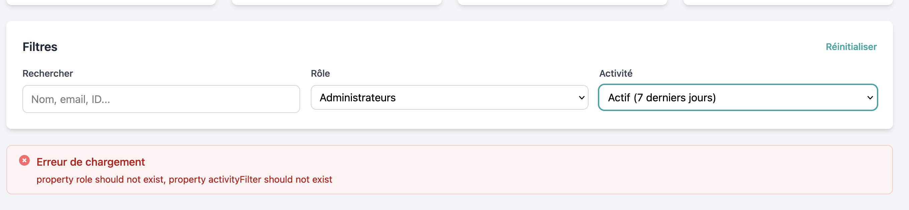

# React + TypeScript + Vite


## Running the project for dev

If you want to start the dev server use the following command

```sh
npm run dev
```
This command will start a webserver on the url: `http://localhost:5173/`


## Building the production version

Use the following command to build a production ready bundle for the app/

```sh
npm run build
```

This will store the result under a `dist` file.

# Architecture & Design decisions

This project is connected to a backend API that provide several endpoints, we are focused on the Admin dashboard integration only, which can be accessed under the `/admin/*` url. The architecture has several components such as the authentication which is made using a mix of JWT + Localstorage. All the pages uses the `Suspense API` to render loading state and handle API calls waiting. The API calls are wrapped around a set of utility classes, function and a API Client that handle the request/responses cycle to provide a clean API that can be used by other parts of the system, this also helps with error handling. 

The project has a clear separation between the components and the pages and also has some specific rules to ensure the coherence and maintainability. 
- A `Page` represent an actual web page as the user will see it
- A `Page` is the only one who can `trigger an API call` and `connect to a store`
- A `Component` is only mean to be used inside other page or component, 
- A `Component` is always doing one thing
- A `Component` should not interact with the `localStorage` or access any other information that is not provided as props.

The layout represent some special type of component that shapes how a page is rendered. And they have the right to read from localStorage or make some API calls.

The following sections shows how those component works:
 
## API Client & Communication

The folder `src/libs/api` contains the necessary "services" classe for each entity know by the system, each service inherit from the `BaseResource` and expose a set of methods for accessing the related api. 
the `BaseResource` class create an http client which is a wrapper around the native `fetch` method of the browser, it handle all the headers definitions and management. It also expose the methods for all the http verbs. it has the method `parseResponse` that get the responses of an HTTP query and transform it to the dedicated format (`ApiResponse<T>`) and return it so all the rest of the app can use it. If an error occur it will be cougth there.
This module is used in all the remaning part of the application.

## Authentication

The logic method is used under the `LoginPage.tsx#38`, it interact with the `apiClient` to do so, when the auth is successfull, the `token` , `user` and `refreshToken` are saved to the local storage for further use, they are also saved into the state, the state is built using `Jotai` lib as it allow to create very atomic states.
Not all the page requires the user to be authenticated, the logic is handle inside the `App.tsx` file, which is the entrypoint of the project, built around `React Router`. 
The components `ProtectedRoute` and `AdminRoute` verify if the user is loggedin and if he is an admin before showing the dedicated pages. 
Since the admin pages are store in this same project (bundle) we decide to lazy load them, only when needed. So this is used with the `<Suspense>` component, this help reducing the size of the initial bundle and allow a faster loading time.

## Hooks:

- useAuth() : this hook is used to verify the authentication state of a user by reading the auth state from the localstorage

## types:

All the types are written as `interface` under the `src/libs/interfaces/*` folder

## Utils:

There are some date display utility store under the `src/libs/utils/*` folder

## Components:

The `Error` component is responsible of displaying error message to the user, it's used in the various admin pages.


#### NOTE I left a page that generate error to demonstrate how that component work: this is the page : `http://localhost:5173/admin/users`




## Expanding the ESLint configuration

If you are developing a production application, we recommend updating the configuration to enable type-aware lint rules:

```js
export default tseslint.config([
  globalIgnores(['dist']),
  {
    files: ['**/*.{ts,tsx}'],
    extends: [
      // Other configs...

      // Remove tseslint.configs.recommended and replace with this
      ...tseslint.configs.recommendedTypeChecked,
      // Alternatively, use this for stricter rules
      ...tseslint.configs.strictTypeChecked,
      // Optionally, add this for stylistic rules
      ...tseslint.configs.stylisticTypeChecked,

      // Other configs...
    ],
    languageOptions: {
      parserOptions: {
        project: ['./tsconfig.node.json', './tsconfig.app.json'],
        tsconfigRootDir: import.meta.dirname,
      },
      // other options...
    },
  },
])
```

You can also install [eslint-plugin-react-x](https://github.com/Rel1cx/eslint-react/tree/main/packages/plugins/eslint-plugin-react-x) and [eslint-plugin-react-dom](https://github.com/Rel1cx/eslint-react/tree/main/packages/plugins/eslint-plugin-react-dom) for React-specific lint rules:

```js
// eslint.config.js
import reactX from 'eslint-plugin-react-x'
import reactDom from 'eslint-plugin-react-dom'

export default tseslint.config([
  globalIgnores(['dist']),
  {
    files: ['**/*.{ts,tsx}'],
    extends: [
      // Other configs...
      // Enable lint rules for React
      reactX.configs['recommended-typescript'],
      // Enable lint rules for React DOM
      reactDom.configs.recommended,
    ],
    languageOptions: {
      parserOptions: {
        project: ['./tsconfig.node.json', './tsconfig.app.json'],
        tsconfigRootDir: import.meta.dirname,
      },
      // other options...
    },
  },
])
```
